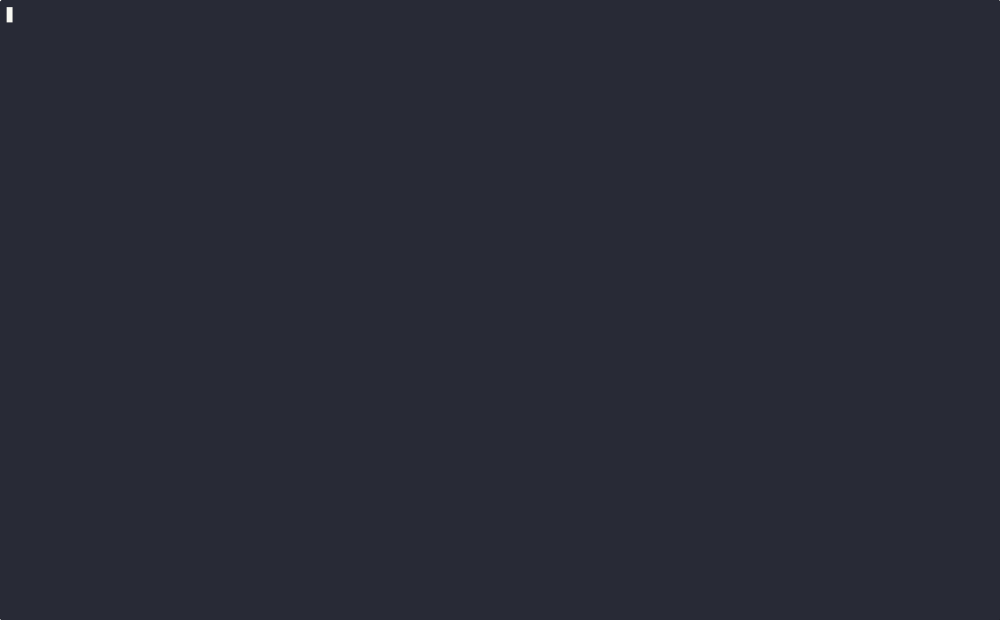

# mini-microservices-spring-angular

A mini microservices stack with Spring Boot backends, an Angular frontend, an Nginx gateway, and a polyglot Python/FastAPI notification worker.

### Demo

[](./demo/demo.gif)

## Table of Contents

- [Prerequisites](#prerequisites)
- [Installation](#installation)
- [Usage](#usage)
- [API and Gateway Routes](#api-and-gateway-routes)
- [Environment Variables](#environment-variables)
- [Build and Push Images](#build-and-push-images)
- [License](#license)
- [Author](#author)

## Prerequisites

- Docker Engine
- Docker Compose plugin
- A Docker Hub account if you want to publish your own images
- Twilio account and credentials if you test SMS delivery

## Installation

```bash
git clone https://github.com/firassBenNacib/mini-microservices-spring-angular.git
cd mini-microservices-spring-angular
cp .env.example .env
```

Update `.env` with real values before running the stack.

## Usage

### Compose Files and Roles

- `docker-compose.yml`: base stack definition with pinned immutable image digests (reproducible default).
- `docker-compose.images.yml`: switches app services to tag-based published images (`DOCKERHUB_USERNAME` + `IMAGE_TAG` from `.env`).
- `docker-compose.build.yml`: enables local builds from source with local image tags (`IMAGE_TAG` from `.env`).
- `docker-compose.dev.yml`: dev-only host port exposure for MySQL and Mailpit (bound to localhost only).

### Common Run Patterns

1. Run pinned immutable images:

```bash
docker compose -f docker-compose.yml pull
docker compose -f docker-compose.yml up -d
docker compose -f docker-compose.yml ps
```

2. Run published demo-tag images:

```bash
docker compose -f docker-compose.yml -f docker-compose.images.yml pull
docker compose -f docker-compose.yml -f docker-compose.images.yml up -d
docker compose -f docker-compose.yml -f docker-compose.images.yml ps
```

3. Build from local source:

```bash
docker compose -f docker-compose.yml -f docker-compose.build.yml up -d --build
docker compose -f docker-compose.yml -f docker-compose.build.yml ps
```

4. Add dev overlay (DB/Mailpit host ports) to either images or build mode:

```bash
docker compose -f docker-compose.yml -f docker-compose.images.yml -f docker-compose.dev.yml up -d
docker compose -f docker-compose.yml -f docker-compose.build.yml -f docker-compose.dev.yml up -d --build
```

Stop stack:

```bash
docker compose -f docker-compose.yml down --remove-orphans
```

Remove stack and volumes:

```bash
docker compose -f docker-compose.yml down --remove-orphans --volumes
```

## API and Gateway Routes

Public entrypoint: `http://localhost:8085`

- `/auth/*` -> `auth-service`
- `/api/*` -> `api-service`
- `/audit/*` -> `audit-service`
- `/notify/health` -> `notification-service` health
- `/notify/twilio/status` -> Twilio delivery callback endpoint
- `/` -> `frontend`

## Environment Variables

Minimum required values in `.env`:

- `APP_JWT_SECRET`
- `APP_DEMO_USER_PASSWORD`
- `SPRING_DATASOURCE_USERNAME`
- `SPRING_DATASOURCE_PASSWORD`
- `MAILER_API_KEY`
- `NOTIFY_API_KEY`
- `AUDIT_API_KEY`
- `TWILIO_ACCOUNT_SID`
- `TWILIO_AUTH_TOKEN`
- `TWILIO_FROM_NUMBER`
- `SPRING_MAIL_HOST`
- `SPRING_MAIL_PORT`
- `SPRING_MAIL_USERNAME`
- `SPRING_MAIL_PASSWORD`
- `DOCKERHUB_USERNAME`

Optional:

- `TWILIO_STATUS_CALLBACK_URL`

## Build and Push Images

Use immutable tags (for example `1.0.0` or a git SHA), not `latest`.

```bash
docker login
DOCKERHUB_USERNAME=your-dockerhub-username
IMAGE_TAG=1.0.0

DOCKER_BUILDKIT=1 docker build -t ${DOCKERHUB_USERNAME}/mini-spring-auth:${IMAGE_TAG} ./backend/auth-service
DOCKER_BUILDKIT=1 docker build -t ${DOCKERHUB_USERNAME}/mini-spring-api:${IMAGE_TAG} ./backend/api-service
DOCKER_BUILDKIT=1 docker build -t ${DOCKERHUB_USERNAME}/mini-spring-mailer:${IMAGE_TAG} ./backend/mailer-service
DOCKER_BUILDKIT=1 docker build -t ${DOCKERHUB_USERNAME}/mini-spring-audit:${IMAGE_TAG} ./backend/audit-service
DOCKER_BUILDKIT=1 docker build -t ${DOCKERHUB_USERNAME}/mini-spring-notification:${IMAGE_TAG} ./backend/notification-service
DOCKER_BUILDKIT=1 docker build -t ${DOCKERHUB_USERNAME}/mini-spring-frontend:${IMAGE_TAG} ./frontend
DOCKER_BUILDKIT=1 docker build -t ${DOCKERHUB_USERNAME}/mini-spring-gateway:${IMAGE_TAG} ./gateway

docker push ${DOCKERHUB_USERNAME}/mini-spring-auth:${IMAGE_TAG}
docker push ${DOCKERHUB_USERNAME}/mini-spring-api:${IMAGE_TAG}
docker push ${DOCKERHUB_USERNAME}/mini-spring-mailer:${IMAGE_TAG}
docker push ${DOCKERHUB_USERNAME}/mini-spring-audit:${IMAGE_TAG}
docker push ${DOCKERHUB_USERNAME}/mini-spring-notification:${IMAGE_TAG}
docker push ${DOCKERHUB_USERNAME}/mini-spring-frontend:${IMAGE_TAG}
docker push ${DOCKERHUB_USERNAME}/mini-spring-gateway:${IMAGE_TAG}
```

## License

This project is licensed under the [MIT License](./LICENSE).

## Author

Created and maintained by Firas Ben Nacib - [bennacibfiras@gmail.com](mailto:bennacibfiras@gmail.com)
