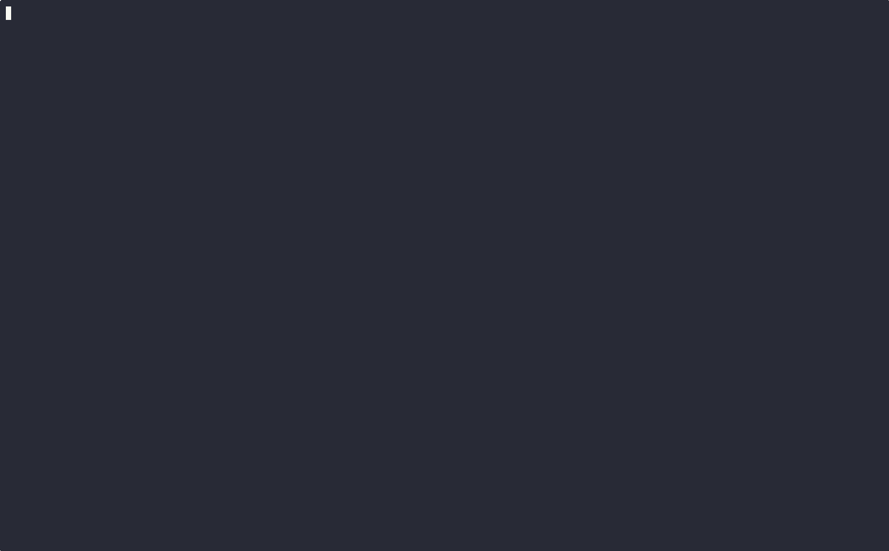
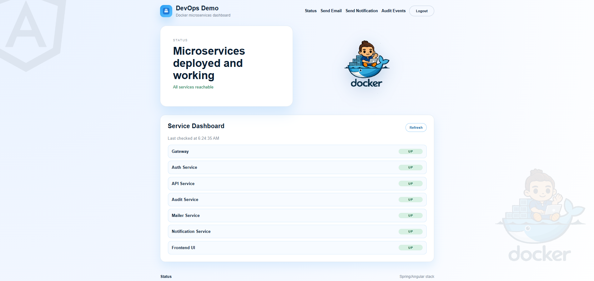
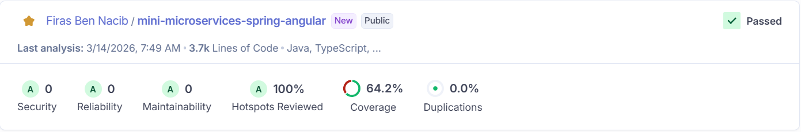

# mini-microservices-spring-angular

A mini microservices application with Spring Boot backends, an Angular frontend, an Nginx gateway, and a polyglot Python/FastAPI notification worker.

### Demo

[](./demo/demo.gif)



## Table of Contents

- [Prerequisites](#prerequisites)
- [Installation](#installation)
- [Usage](#usage)
- [API and Gateway Routes](#api-and-gateway-routes)
- [Environment Variables](#environment-variables)
- [Make Targets](#make-targets)
- [Build and Push Images](#build-and-push-images)
- [CI/CD and Security Workflows](#cicd-and-security-workflows)
- [GitHub Actions Configuration](#github-actions-configuration)
- [Public vs Local Files](#public-vs-local-files)
- [License](#license)
- [Author](#author)

## Prerequisites

- Docker Engine
- Docker Compose plugin
- A Docker Hub account if you want to publish your own images
- Twilio account and credentials if you test SMS delivery

## Installation

```bash
git clone https://github.com/firassBenNacib/mini-microservices-spring-angular.git
cd mini-microservices-spring-angular
cp .env.local.example .env
```

Update `.env` with real values before running the application.

## Usage

### Compose Files and Roles

- `docker-compose.yml`: base application definition with pinned immutable image digests (reproducible default, requires `DOCKERHUB_USERNAME` in `.env`).
- `docker-compose.images.yml`: switches app services to tag-based published images (requires `DOCKERHUB_USERNAME`; uses `IMAGE_TAG` from `.env`).
- `docker-compose.build.yml`: enables local builds from source with local image tags (`IMAGE_TAG` from `.env`) and does not require a Docker Hub username.
- `docker-compose.dev.yml`: dev-only host port exposure for MySQL and Mailpit (bound to localhost only).

### Common Run Patterns

1. Run pinned immutable images:

```bash
docker compose -f docker-compose.yml pull
docker compose -f docker-compose.yml up -d
docker compose -f docker-compose.yml ps
```

2. Run published demo-tag images:

```bash
docker compose -f docker-compose.yml -f docker-compose.images.yml pull
docker compose -f docker-compose.yml -f docker-compose.images.yml up -d
docker compose -f docker-compose.yml -f docker-compose.images.yml ps
```

3. Build from local source:

```bash
DOCKERHUB_USERNAME=local docker compose -f docker-compose.yml -f docker-compose.build.yml up -d --build
DOCKERHUB_USERNAME=local docker compose -f docker-compose.yml -f docker-compose.build.yml ps
```

4. Add dev overlay (DB/Mailpit host ports) to either images or build mode:

```bash
docker compose -f docker-compose.yml -f docker-compose.images.yml -f docker-compose.dev.yml up -d
DOCKERHUB_USERNAME=local docker compose -f docker-compose.yml -f docker-compose.build.yml -f docker-compose.dev.yml up -d --build
```

Stop services:

```bash
docker compose -f docker-compose.yml down --remove-orphans
```

Remove services and volumes:

```bash
docker compose -f docker-compose.yml down --remove-orphans --volumes
```

Troubleshooting:

- If you see `required variable DOCKERHUB_USERNAME is missing a value: DOCKERHUB_USERNAME is required`, add `DOCKERHUB_USERNAME` to `.env` and rerun pinned/images modes.

## API and Gateway Routes

Public entrypoint: `http://localhost:8085`

- `/auth/*` -> `auth-service`
- `/api/*` -> `api-service`
- `/audit/*` -> `audit-service`
- `/gateway/health` -> gateway health
- `/gateway/status` -> aggregated internal service status
- `/notify/twilio/status` -> Twilio delivery callback endpoint
- `/` -> `frontend`

## Environment Variables

Use separate environment files by runtime:

- [`.env.local.example`](./.env.local.example): local Docker Compose development
- [`.env.cloud-provider.example`](./.env.cloud-provider.example): cloud deployment runtime reference

For local work:

```bash
cp .env.local.example .env
```

`.env.local.example` is intended to boot the local application with safe demo values. Keep real cloud credentials out of it.

For a cloud deployment, keep real values in your secret manager, task definition, or deployment system rather than committing a real `.env`.

Minimum required values in `.env`:

- `APP_JWT_SECRET`
- `APP_DEMO_USER_PASSWORD`
- `SPRING_DATASOURCE_USERNAME`
- `SPRING_DATASOURCE_PASSWORD`
- `MAILER_API_KEY`
- `NOTIFY_API_KEY`
- `AUDIT_API_KEY`
- `TWILIO_ACCOUNT_SID`
- `TWILIO_AUTH_TOKEN`
- `TWILIO_FROM_NUMBER`
- `SPRING_MAIL_HOST`
- `SPRING_MAIL_PORT`
- `SPRING_MAIL_USERNAME`
- `SPRING_MAIL_PASSWORD`
- `DOCKERHUB_USERNAME`

Optional:

- `IMAGE_TAG`
- `TWILIO_STATUS_CALLBACK_URL`

## Make Targets

The public operator interface for local work is the [Makefile](./Makefile).

Common targets:

- `make up`: pull pinned images and start the application
- `make up-images`: start the published tag-based application
- `make up-build`: build from local source and start the application
- `make up-dev-images`: start published images with localhost dev ports
- `make up-dev-build`: build locally with localhost dev ports
- `make down`: stop the application and remove containers/networks
- `make down-volumes`: stop the application and remove volumes too
- `make ps`: show container status
- `make logs`: tail gateway, auth-service, and api-service logs
- `make compose-validate`: validate compose overlays against `.env.local.example`
- `make smoke-test BASE_URL=https://example.com`: run HTTP smoke checks and authenticated checks when credentials are configured
- `make integration-test`: run a compose-backed gateway integration flow from local source
- `make publish-frontend-build`: build the Angular frontend only
- `make publish-frontend BUCKET=<bucket> [DISTRIBUTION_ID=<id>]`: publish frontend assets to object storage
- `make push-dockerhub DOCKERHUB_USERNAME=<name> ...`: build and push all images to DockerHub
- `make push-ecr CLOUD_PROVIDER_REGION=<region> ...`: build and push all images to ECR
- `make create-cloud-secrets ENVIRONMENT=<name> [ENV_FILE=.env]`: create runtime secrets from a local env file

## Build and Push Images

Use immutable tags such as a git SHA or release tag, not `latest`.
For normal publishing, prefer the Make targets or GitHub Actions over long ad hoc Docker command sequences.

```bash
make push-dockerhub DOCKERHUB_USERNAME=your-user IMAGE_TAG=1.0.0
make push-ecr CLOUD_PROVIDER_REGION=eu-west-1 IMAGE_TAG=1.0.0
```

## CI/CD and Security Workflows

SonarQube quality gate snapshot:



The repo uses a small set of production-oriented workflows under [`.github/workflows/`](./.github/workflows):

- `ci.yml`: workflow lint, Dockerfile lint, shell lint, compose validation, frontend build/tests, service tests, and image build verification
- `dependency-review.yml`: dependency review on pull requests
- `codeql.yml`: SAST for Java, JavaScript/TypeScript, and Python
- `security-baseline.yml`: Gitleaks history scanning plus Trivy secret/config scanning
- `container-security.yml`: SBOM generation plus Grype image scanning; Grype remains a CI gate and artifact report, while GitHub code scanning stays focused on source and SARIF-based findings
- `image-advisory-report.yml`: scheduled/manual stricter Grype reporting for fixed `HIGH,CRITICAL` image vulnerabilities
- `dast.yml`: manual live-target DAST with OWASP ZAP and optional Nuclei
- `smoke-tests.yml`: scheduled and manual smoke tests against the stable deployed application, including authenticated flows when smoke credentials are configured
- `integration-tests.yml`: scheduled/manual compose-backed gateway integration checks, and the same flow is reused as a PR CI gate when relevant paths change
- `scorecard.yml`: OSSF Scorecard report artifact for repository governance posture
- `dockerhub-publish.yml`: publish, attest, and keylessly sign release-tagged images in DockerHub
- `ecr-publish.yml`: publish, attest, and keylessly sign release-tagged images in ECR
- `frontend-s3-deploy.yml`: build the frontend, deploy it to object storage, and run release smoke checks when `SMOKE_BASE_URL` is configured; `workflow_dispatch` can override the bucket, backend API URL, and smoke targets for non-prod rollouts

Normal publish behavior is tag-driven:

- push a `v*` tag to trigger image publish and frontend deploy workflows
- use `workflow_dispatch` for live-environment workflows and controlled reruns or manual backfills
- keep live deploy, DAST, and smoke workflows behind a GitHub `production` environment with required reviewers or wait timers

## GitHub Actions Configuration

Use GitHub repository or environment **Variables** for non-sensitive configuration:

- `CLOUD_PROVIDER_REGION`
- `CLOUD_PROVIDER_ROLE_TO_ASSUME`
- `FRONTEND_BUCKET`
- `FRONTEND_DISTRIBUTION_ID` (optional)
- `FRONTEND_PUBLIC_API_BASE_URL`
- `DAST_TARGET_URL`
- `SMOKE_BASE_URL`
- `SMOKE_BACKEND_BASE_URL` (optional, defaults to `SMOKE_BASE_URL`)
- `DOCKERHUB_USERNAME`
- `DOCKERHUB_NAMESPACE`
- `ECR_IMAGE_NAMESPACE` (optional, defaults to `microservices`)

Use GitHub **Secrets** only for sensitive values:

- `DOCKERHUB_TOKEN`
- `SMOKE_AUTH_EMAIL` (optional)
- `SMOKE_AUTH_PASSWORD` (optional)

The deploy and publish workflows use GitHub OIDC for cloud authentication, so long-lived cloud access keys are not required.

For live deploy controls, create a GitHub environment named `production` and attach the protection rules you want there, for example required reviewers, deployment branch restrictions, and wait timers. The live deploy, DAST, and smoke workflows are wired to use that environment.

Dependabot is configured for ongoing weekly refreshes of Actions, service dependencies, and frontend dependencies through [`.github/dependabot.yml`](./.github/dependabot.yml).

## Public vs Local Files

Safe to push to a public repository:

- application source code
- Dockerfiles and Compose files
- `Makefile`
- `scripts/`
- `.github/workflows/`
- example environment contracts:
  - `.env.local.example`
  - `.env.cloud-provider.example`
- repo metadata such as `.github/dependabot.yml` and `.github/WORKFLOWS.md`

Keep local and do not commit:

- `.env`
- any real secret values copied from Twilio, SMTP, JWT, or database credentials
- built frontend artifacts under `frontend/dist/`
- local caches such as `frontend/node_modules/`
- any scratch output in `.artifacts/`

## License

This project is licensed under the [MIT License](./LICENSE).

## Author

Created and maintained by Firas Ben Nacib - [bennacibfiras@gmail.com](mailto:bennacibfiras@gmail.com)
